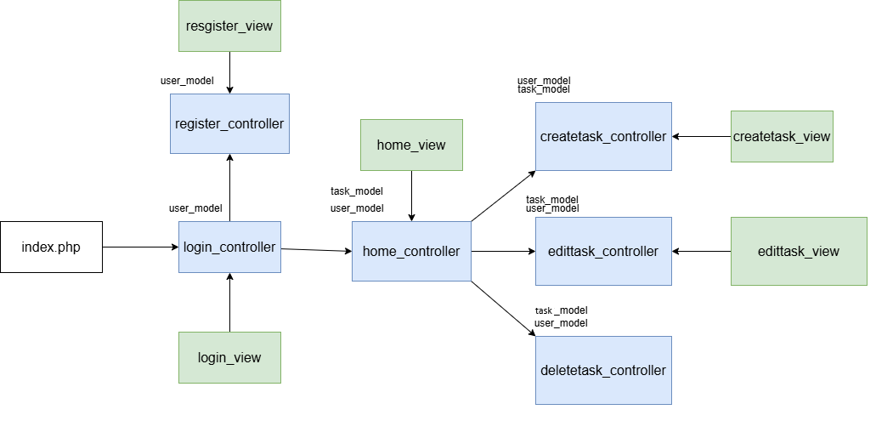
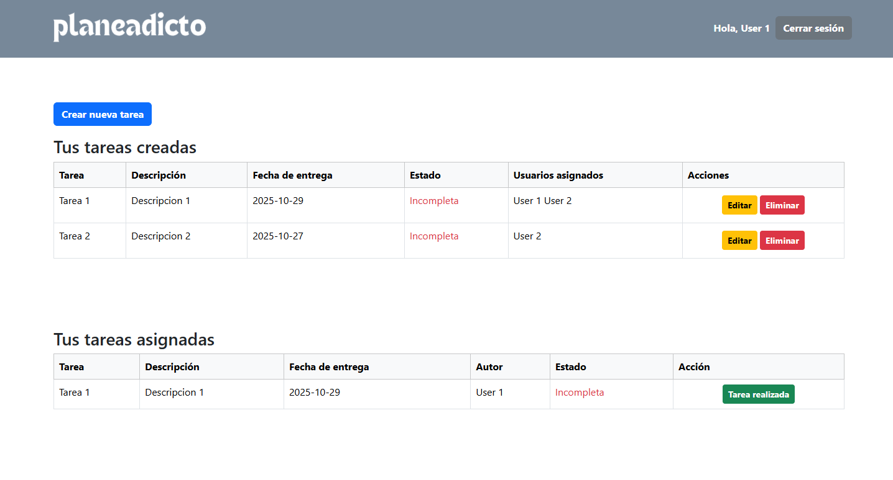

# Task Planner
## Overview
This is a multi user task planner which lets users Create, Read, Update, Delete and assign tasks to other users.

- Users need to be registered and logged in before being able to create a task.  
- When a user creates a task (active user) he gains ownership over said task.  
- Active users can add a title, description, due date, assign users and edit or delete the task.  
- Users assigned to the task (passive users) are the only ones that can report the task as completed.  
- The owner of the task gets notified when the task is completed.  

## Technologies used

- PHP with mysqli
- MySQL
- HTML/CSS (Bootstrap)

## Flow

## Dashboard

